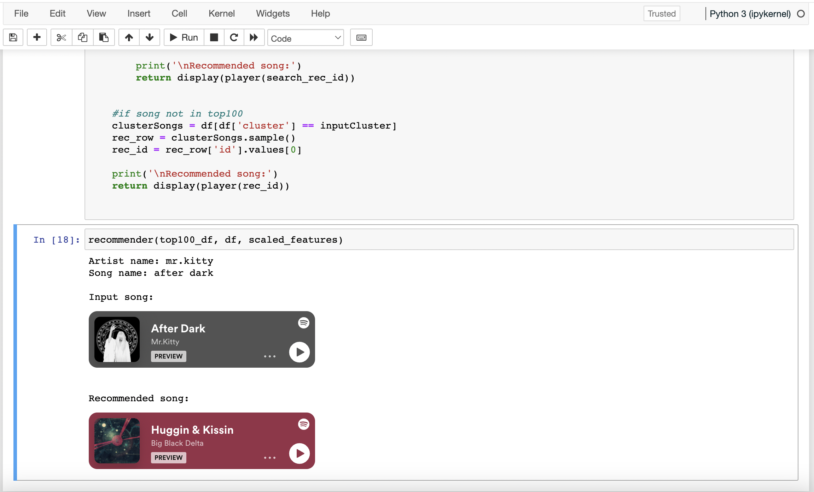

# Song recommender
This project implements a K-Means Clustering model that utilizes the Spotify API and web scraping.

The main function in the notebook accepts inputs of artist and song names. It then displays the initial song and recommends a similar song from the same cluster of features, including danceability, energy, loudness, mode, speechiness, acousticness, instrumentalness, liveness, valence, and tempo.

